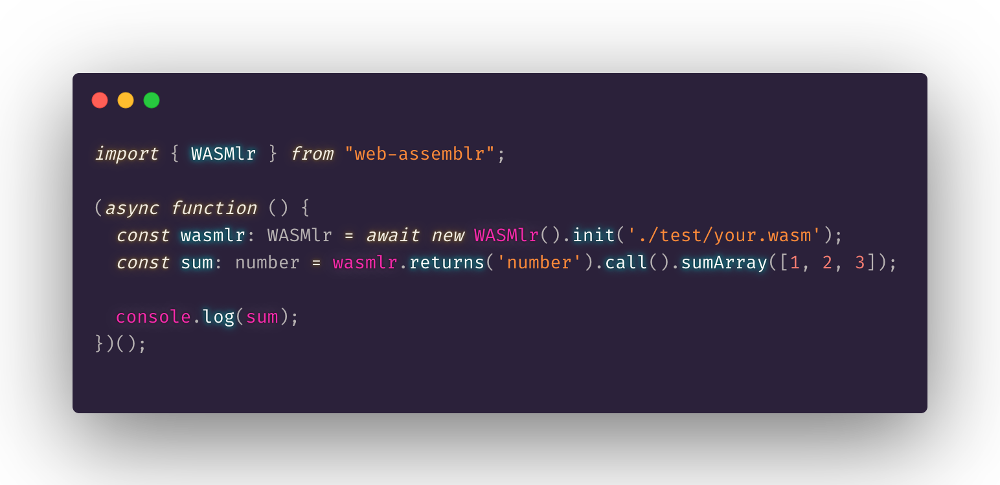
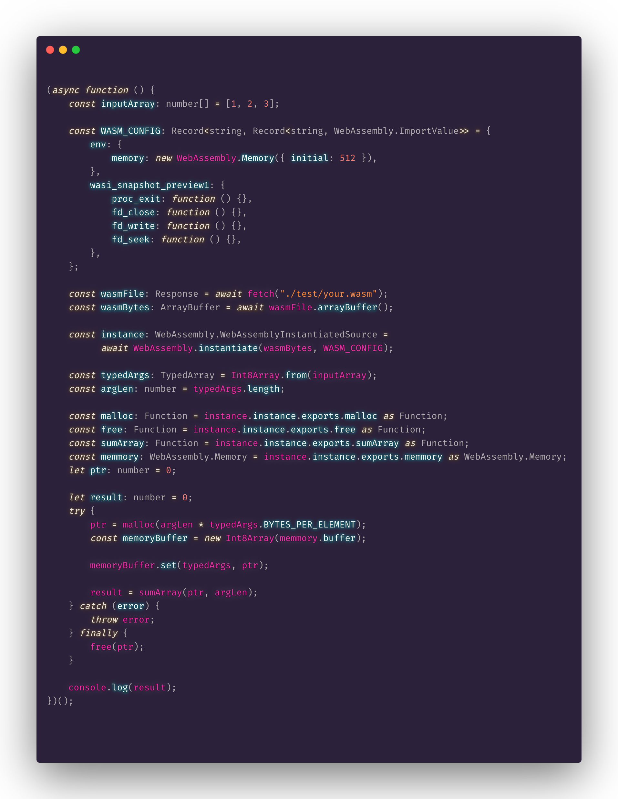

<!-- PROJECT LOGO -->
<br />
<p align="center">
  <a href="https://github.com/FarazzShaikh/WebAssemblr">
    
  </a>

  <h3 align="center">WebAssemblr</h3>

  <p align="center">
    A dead simple way to call WebAssembly form your script.
    <br />
    <a href="TODO"><strong>Explore the docs »</strong></a>
    <br />
    <br />
    <a href="#getting-started">Get Started</a>
    ·
    <a href="TODO">Report Bug</a>
    ·
    <a href="TODO">Request Feature</a>
  </p>
</p>

<!-- TABLE OF CONTENTS -->
<details open="open">
  <summary>Table of Contents</summary>
  <ol>
    <li>
      <a href="#about-the-project">About The Project</a>
    </li>
    <li>
      <a href="#getting-started">Getting Started</a>
      <ul>
        <li><a href="#node">Node</a></li>
        <li><a href="#browser">Browser</a></li>
      </ul>
    </li>
    <li><a href="#usage">Usage</a></li>
    <li>
      <a href="#compilation">Compilation</a>
      <ul>
        <li><a href="#optional-prerequisites">Optional prerequisites</a></li>
      </ul>
    </li>
    <li>
      <a href="#miscellaneous">Miscellaneous</a>
       <ul>
        <li><a href="#roadmap">Roadmap</a></li>
        <li><a href="#contributing">Contributing</a></li>
        <li><a href="#license">License</a></li>
        <li><a href="#contact">Contact</a></li>
        <li><a href="#acknowledgements">Acknowledgements</a></li>
      </ul>
    </li>
  
  </ol>
</details>


<!-- ABOUT THE PROJECT -->
## About The Project

<p align="center">
  
</p>
WebAssembly is the next big thing! But setting it up is complicated and tedious. So I made this little library that does all the hardwork for you. Above is a function call to a web assembly function to sum up all elements of an array in TypeScript. Bellow, is the same code, but without *WASMlr*. (Spoiler: WASMlr saves you a lot of key presses)

<details>
  <p align="center">
    
  </p>
</details>

---

## Getting Started
WASMlr is multiplatform, which means it works on both Node and Browsers (Deno support soon).

### Node
You can use NPM to easily install the lastest verison of WASMlr.
``` sh
npm i web-assemblr
```
Then simply require or import as necessary.
```js
import { WASMlr } from "web-assemblr";

// or

const { WASMlr } = require("web-assemblr");
```

### Browser
For the browser, you can download and use [`/lib/web/src/WebAssemblr.js`](https://github.com/FarazzShaikh/WebAssemblr/tree/master/lib/web/) from `/lib/web` in this repository. Remember to download and include the entire web folder in your project, as WASMlr currently depends on `/lib/web/utils/*` to provide functionality.

Then, you can use ES6 imports or a script tag.
```js
import { WASMlr } from "./Path/to/downloaded/src/WebAssemblr.js";
```
or
```html
<script 
  src="./Path/to/downloaded/src/WebAssemblr.js"
  type="module"
>
</script>
```
---

## Usage
WebAssemblr provides one easy-to-use class. This class must be instantiated using its `init()` function. Remember, this initialization is asyncronous.
```ts
import { WASMlr } from "web-assemblr";

(async function () {
  const wasmlr: WASMlr = await new WASMlr().init('./test/your.wasm');
})();
```
The `init()` function takes in the path to your `.wasm` file. In NodeJS, this path has to be an absolute path.
```ts
const path = require("path")
const wasmPath = path.resolve(__dirname, relativePath)
```

Once an instance has been created, you can set the return type using `returns()` and then call your funciton by its name defined in your source file by chining `call()`.
```ts
const sum: number = wasmlr
  .returns('number')
  .call()
  .sumArray([1, 2, 3]);
```
**Note: C++ funciton names are magled by the compiler. To avoid this, your funcitons must be wrapped in `extern "C" {...}`, you can read about this in the [compilation](#compilation) section.**

For a more indepth look at the functins and interfaces avilable, take a loog at the [API Refrence](TODO)

---

## Compilation
Currently, ony C and C++ source files are tested. I will test and improve support over time. To compile, you can use the included WASMlr CLI or compile them manually with required options.

Note: You will have to have Emscripten installed and available in your `$PATH`.

### CLI
To use the WASMlr CLI, you must have ether installed the package using NPM or you can install only the CLI from NPM [here](TODO). To get help on usage and options run
```sh
wasmlr -h
```
You can refer to the CLI's documentation for more information on how to use it.

### Optional prerequisites
WebAssemblr comes with object supprt out of the box, however, objects are serialized and written to memmory in the [MessagePack](https://msgpack.org/index.html) format. You will have to ether install a MessagePack encoding/decoding library for your prefered source language or write the encode/decode functions yourself.

Passing around object is slow and is not recomemded. I recomend serializing your objects into Arrays and passing around arrays instead.

---

## Miscellaneous
### Roadmap
This libary and its CLI is 100% a passion project of mine. Some features i would like to add in the future are -

- Support for more source languages
- Code optimizations
- Removeing the dependance on MessagePack

You can request any feature you like [here](TODO).

### Contributing
Contributions are what make the open source community such an amazing place to be learn, inspire, and create. Any contributions you make are **greatly appreciated**.

1. Fork the Project
2. Create your Feature Branch (`git checkout -b feature/AmazingFeature`)
3. Commit your Changes (`git commit -m 'Add some AmazingFeature'`)
4. Push to the Branch (`git push origin feature/AmazingFeature`)
5. Open a Pull Request

### License
Distributed under the MIT License. See `LICENSE` for more information.

### Contact
Faraz Shaikh - [@faar.az](https://www.instagram.com/faar.az/) - farazzshaikh@gmail.com

Project Link: https://github.com/FarazzShaikh/WebAssemblr


### Acknowledgements
**People**
* [Shubham Gupto](https://github.com/IamShubhamGupto) - Helping with C/C++ tests 
* [Dan Ruta](https://becominghuman.ai/passing-and-returning-webassembly-array-parameters-a0f572c65d97) - About array support
* [Torgeir Helgevold](https://www.syntaxsuccess.com/viewarticle/sharing-complex-types-between-c++-webassembly-and-javascript) - About object Support

**Resources**
* [carbon](https://carbon.now.sh/) - Beautiful images of source code.
* [Emscripten](https://emscripten.org/) - C/C++ -> WASM Compiler
* [MDN-WebAssembly](https://developer.mozilla.org/en-US/docs/WebAssembly) - WASM API Refrence

---